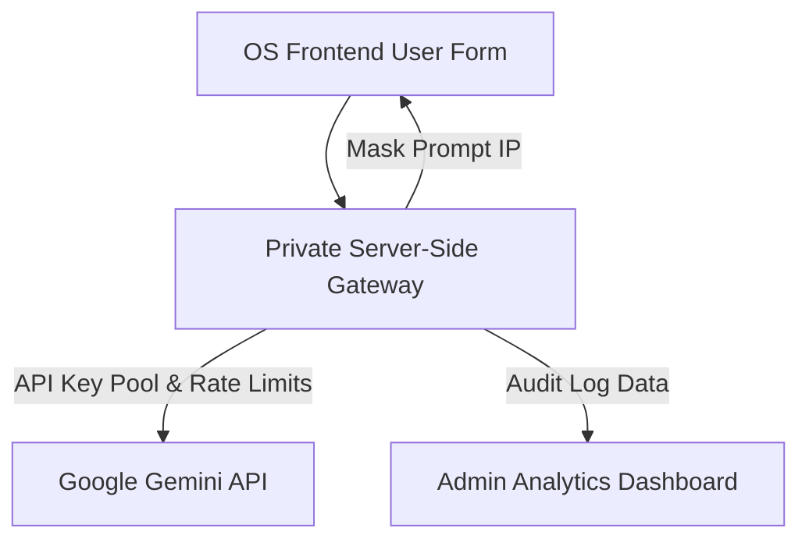

# PromptForms (FormPrompt)

> Turn complex system instructions with dynamic variables into beautiful, interactive, production-ready form interfaces with real-time AI streaming.

[](#)
[](#)
[](#)
[](#)

PromptForms is a developer-first, open-source tool designed to bridge the gap between prompt engineering and non-technical employee execution. Managers and power users write complex instructions containing double-curly-braces variables (e.g., `{{topic}}` or `{{code_snippet}}`). The application automatically parses these variables, generates a polished Tailwind-styled input form, replaces placeholder parameters, and streams response content securely directly from Google's Gemini 2.5 Flash API.

---

## ⚡ Key Features

*   **Dynamic Form Compilation**: Automatically parses double-curly-braces variables (e.g., `{{variable}}`) in real-time inside the prompt editor and instantly compiles them into dynamic, reactive form fields.
*   **Direct Gemini Streaming**: Connects securely to the Google Gemini 2.5 Flash API using the client's own API key. Tokens are streamed directly to the browser with active progress packet detection.
*   **Zero-Dependency Markdown Parser**: A custom, lightweight, streaming-safe React markdown renderer built from scratch to format headers, bullet points, numbered lists, bold text, and multi-line code blocks mid-stream without bulky third-party libraries.
*   **Smart Field Heuristics**: Form inputs automatically adapt to variables. Variable names indicating large-scale text (like `code_snippet` or `context`) render as multi-line textareas, while standard variables render as crisp single-line inputs.
*   **Lead Capture Funnel**: Operational B2B waitlist capture card equipped with simulated latency loaders and whitelisting queue position tracking, prepared for easy Supabase integration.
*   **Secure Local Storage**: Keeps prompt templates, API configurations, and waitlist metrics entirely local-first inside your browser's `LocalStorage` for total privacy and zero database costs.

---

## 🛠️ Tech Stack Breakdown

*   **Core**: React 19 (Functional Components, Custom Hooks)
*   **Bundler & Runtime**: Vite, TypeScript (Strict Mode)
*   **AI Integration**: `@google/generative-ai` (Gemini 2.5 Flash)
*   **Styling**: Tailwind CSS v4 (CSS-driven custom themes & HSL tech variables)
*   **Icons**: `lucide-react` (Sleek UI indicators)

---

## 🚀 Quick Start & Installation

Ensure you have [Node.js](https://nodejs.org/) installed on your machine.

### 1. Clone the repository
```bash
git clone https://github.com/your-username/promptforms.git
cd promptforms
```

### 2. Install dependencies
```bash
npm install
```

### 3. Start the local development server
```bash
npm run dev
```
Open your browser and navigate to `http://localhost:5173`.

### 4. Configure Gemini API Access
1.  Click the prominent **"Configure Gemini Key"** button in the top right.
2.  Follow the embedded link to [Google AI Studio](https://aistudio.google.com/).
3.  Generate a free API key and paste it into the secure input modal.
4.  Test the handshake connection directly inside the settings modal before saving.

---

## 📁 File Architecture Overview

The repository features a clean, highly modular React architecture designed for optimal legibility and strict TypeScript type-safety:

```
src/
├── types/
│   └── index.ts               # Shared interfaces (PromptTemplate, WaitlistSubmission)
├── hooks/
│   └── useGemini.ts           # Custom text streaming hook using Google Gen AI
├── components/
│   ├── SettingsModal.tsx      # Secure API Key configuration & live connection testing
│   ├── Sidebar.tsx            # Persistent sidebar navigation & deep-linking handlers
│   ├── PromptManager.tsx      # Template CRUD manager with live variable regex parsing
│   ├── DynamicFormRenderer.tsx# Smart forms compiler substituting variables
│   ├── OutputDisplay.tsx      # Real-time console terminal & custom markdown parser
│   └── WaitlistSection.tsx    # Striking B2B waitlist showcase & simulated queue builder
├── App.tsx                    # Master layout coordination, routing, and preset seeding
├── index.css                  # Tailwind CSS v4 directive and dark-mode themes
├── main.tsx                   # React DOM render mount
└── vite-env.d.ts              # Vite environment declarations
```

---

## 🏢 B2B Commercial Expansion (The Strategy)

While the open-source client-side MVP handles single-user needs, the blueprint for the upcoming **PromptForms Teams** tier addresses commercial agency pain points:



*   **Server-Side IP Protection**: In many agencies, the "complex system instructions" are a core business asset (IP). The Teams upgrade processes submissions through a secure server-side endpoint. End-users see clean input forms, but the underlying system prompt is never exposed to their browser inspect panels.
*   **Cost Pooling & Key Limits**: Pool corporate API keys in a centralized vault. Allocate strict daily or weekly token quotas to individual employee workspaces to prevent cost surges.
*   **Centralized Catalogs**: Share folders and prompt catalogs across departments with robust access controls (Creator, Editor, Operator).
*   **Audit Logging**: Maintain compliant historical logs of every variable submitted, showing exactly who triggered which prompt and what output was generated.

---

## 📄 License

Distributed under the MIT License. See `LICENSE` for more information. Contributions are welcome!
